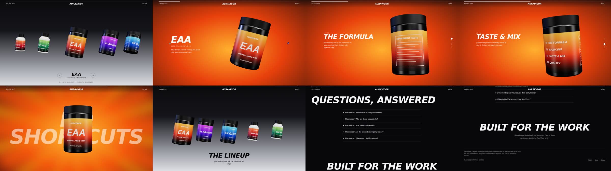
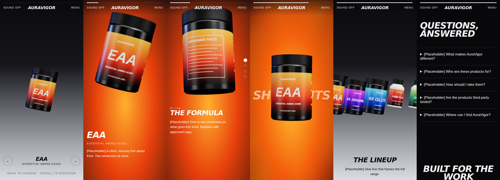

# AuraVigor 品牌站

滚动驱动的 WebGL 3D 产品展示站（纯品牌展示 · 海外英文）。当前阶段：**M0 骨架** —— 5 幕滚动叙事 + FAQ + 收尾全部可运行，内容与视觉为占位。

## 跑起来

```bash
npm install          # Node ≥ 20
npm run dev          # http://localhost:5173
npm run check        # 类型检查 + 单测 + 生产构建（每个 PR 必过）
npm run shots        # 可选：无头浏览器逐幕截图到 ./.shots（首次需 npx playwright install chromium）
```

## 文档地图

| 文件 | 给谁 | 内容 |
|---|---|---|
| `AGENTS.md` | Codex | 工作守则（Codex 会自动读取） |
| `docs/ARCHITECTURE.md` | Codex / 验收人 | 图层、数据流、契约、目录、常见改动怎么做 |
| `docs/TASKS.md` | 所有人 | **三方分工 + 状态表 + 全部任务卡（含验收标准）** |
| `docs/ASSETS.md` | 设计 / 品牌同事 | 标签图、尺寸表、品牌资产、文案的交付规范 |
| `docs/CHECKLIST.md` | 验收人 | PR 验收、素材验收、逐幕视觉、性能兼容、合规、上线清单 |
| `docs/REFERENCE.md` | 所有人 | 参考站逐幕拆解，以及我们借鉴什么、不借鉴什么 |

## 怎么推进

1. 把本仓库推到 GitHub。
2. 团队按 `docs/ASSETS.md` 准备素材（A01–A04 是最大阻塞项）。
3. 按 `docs/TASKS.md` 的顺序，**一次给 Codex 派一张任务卡**（指令模板在该文件 §0）。T01 / T06 / T08 / T10 不依赖素材，可立即开工。
4. 每个 PR 按 `docs/CHECKLIST.md` §1 验收后合并。

## 改内容不用懂代码

产品、文案、主题色、包装尺寸、口号、FAQ 全在 `src/content/`；字体与颜色令牌在 `src/styles/tokens.css`。开发模式左下角的黄色角标会提示还有多少产品在用占位内容。

## 骨架现状截图

桌面（幕 1 → Outro）：



手机（未打磨，见 T13）：


